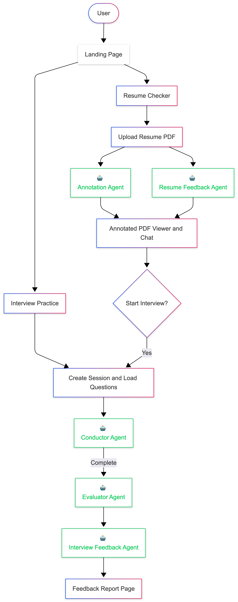

# JobBless

<div align="center">

### Multi-Agent AI Voice Interview Practice Platform — Built on Google ADK

**Practice real interviews with an AI interviewer. Get scored. Get better.**

Built for [KitaHack 2026](https://kitahack.com) | UN SDG 8: Decent Work and Economic Growth

[Documentation](#) &middot; [Video Demo](#)

</div>

---

## The Problem

Malaysian fresh graduates face a critical gap: **they lack interview experience**. Over 300,000 SPM and university graduates enter the Malaysian job market annually — most without any structured interview preparation. Traditional mock interviews require scheduling with mentors, and generic AI chatbots don't simulate the pressure of a live conversation.

## The Solution

**JobBless** conducts realistic voice interviews using curated questions from top Malaysian companies like Grab, Shopee, and Google. After the interview, candidates receive detailed scored feedback with actionable improvement suggestions — all powered by Google's Agent Development Kit (ADK) and Gemini models.

---

## Features

- **Resume Analyzer** — Upload your resume PDF and get coordinate-based annotation overlays highlighting standout sections, plus detailed written feedback on content, structure, and ATS optimization for Malaysian companies.

- **Live Voice Interviews** — Real-time bidirectional audio streaming via Gemini Live API. No typing, just talk.

- **Curated Question Bank** — 150 hand-curated questions from 8 Malaysian companies across behavioral, technical, and situational categories.

- **Multi-Dimensional Scoring** — Each answer scored on Relevance (30%), Depth (25%), Structure (25%), and Communication (20%). STAR method detection for behavioral questions.

- **Detailed Feedback Reports** — Letter grades (A+ to F), per-question breakdowns, top strengths, improvement areas, and actionable next steps.

- **Real-Time Transcription** — Live transcript of both interviewer and candidate speech displayed during the interview.

- **Phase-Managed Flow** — Structured interview progression: Greeting → Questions → Closing → Complete, managed by the AI conductor.

---

## How It Works



---

## Technical Architecture

### System Overview

```
Browser                         FastAPI                         Google Cloud
┌──────────────┐               ┌──────────────────┐            ┌──────────────┐
│  React 19    │  PCM 16kHz    │  WebSocket       │            │              │
│  + Vite      │──binary──────>│  /ws/interview   │            │  Gemini      │
│              │               │                  │──────────> │  Live API    │
│  AudioWorklet│  PCM 24kHz    │  ADK run_live()  │            │  (STT+LLM+  │
│  (recorder)  │<──binary──────│  event stream    │<────────── │   TTS)       │
│              │               │                  │            │              │
│  Transcript  │  JSON         │  transcription + │            │              │
│  display     │<──────────────│  phase events    │            │              │
└──────────────┘               └──────────────────┘            └──────────────┘

Post-Interview Pipeline:
┌─────────────────┐     ┌──────────────────┐     ┌──────────────────┐
│  Transcript     │────>│  Evaluator Agent  │────>│  Feedback Agent   │
│  (from session) │     │  gemini-2.5-pro   │     │  gemini-2.5-pro   │
│                 │     │  Scores answers   │     │  Generates report │
└─────────────────┘     └──────────────────┘     └──────────────────┘

Resume Flow:
┌──────────────┐     ┌───────────────────────┐     ┌────────────────────────┐
│  PDF Upload  │────>│  Resume Annotation     │     │  Resume Feedback Agent │
│              │     │  Agent (bounding boxes)│     │  (structured analysis) │
└──────────────┘     └───────────────────────┘     └────────────────────────┘
```

### Multi-Agent System (Google ADK)

JobBless uses **5 specialised AI agents**, each with a single responsibility, orchestrated via Google ADK:

| Agent                  | Model              | ADK Mode      | Purpose                                                                                                            |
| ---------------------- | ------------------ | ------------- | ------------------------------------------------------------------------------------------------------------------ |
| **Conductor**          | `gemini-2.5-flash` | `run_live()`  | Manages the live voice interview — greets candidate, asks questions, listens, follows up through structured phases |
| **Evaluator**          | `gemini-2.5-pro`   | `run_async()` | Scores each answer on 4 weighted dimensions (1–10 scale)                                                           |
| **Interview Feedback** | `gemini-2.5-pro`   | `run_async()` | Generates comprehensive post-interview report with grades, strengths, and action items                             |
| **Resume Annotation**  | `gemini-2.5-flash` | Direct API    | Reads resume PDF natively via Gemini Files API and returns coordinate-based highlights                             |
| **Resume Feedback**    | `gemini-2.5-flash` | Direct API    | Reviews resume content, structure, and ATS fit for Malaysian tech companies                                        |

The two ADK execution modes map directly to their use cases:

- `run_live()` — used for the Conductor Agent, enabling low-latency bidirectional audio streaming during the interview
- `run_async()` — used for Evaluator and Feedback Agents, enabling deep batch inference after the session ends

### Why These Technologies

| Technology             | Reason                                                                                                                        |
| ---------------------- | ----------------------------------------------------------------------------------------------------------------------------- |
| **Google ADK**         | Provides `LlmAgent`, `Runner`, and `LiveRequestQueue` primitives for coordinating multiple specialised agents cleanly         |
| **Gemini Live API**    | The only API handling STT, LLM, and TTS in a single bidirectional stream — eliminates latency of chaining separate services   |
| **Gemini Files API**   | Allows Gemini to natively understand PDF layout and structure without text extraction — critical for accurate resume analysis |
| **Gemini 2.5 Flash**   | Chosen for latency-sensitive tasks (live interview, resume annotation)                                                        |
| **Gemini 2.5 Pro**     | Chosen for depth-critical tasks (evaluation and feedback report)                                                              |
| **FastAPI**            | Native async support — essential for holding long-lived WebSocket connections and awaiting streaming Gemini responses         |
| **Firebase Firestore** | Stateless session persistence — each session stored by ID, enabling horizontal scaling without session affinity               |

---

## Implementation Details

### Audio Pipeline

The browser captures microphone input at 16kHz PCM using an `AudioWorklet`. Binary frames are sent directly over WebSocket to the FastAPI backend, which forwards them to the Gemini Live API. Gemini returns audio at 24kHz PCM, sent back as binary frames and played via a second `AudioWorklet`. JSON control messages (phase events, transcripts, question metadata) travel over the same WebSocket connection, routed by frame type.

### Single WebSocket, Two Message Types

```
Client → Server (binary):   raw PCM audio at 16kHz
Client → Server (text):     JSON control signals (end session, etc.)

Server → Client (binary):   raw PCM audio at 24kHz from Gemini
Server → Client (text):     JSON events (phase, transcript, question progress)
```

FastAPI's native `receive_bytes()` and `receive_text()` keep the routing clean. The Conductor Agent emits phase changes via ADK tool calls, keeping the agent fully in control of interview state rather than hardcoding it in the server.

### Scoring Dimensions

Each answer is evaluated by the Evaluator Agent across four weighted dimensions:

| Dimension     | Weight | What It Measures                               |
| ------------- | ------ | ---------------------------------------------- |
| Relevance     | 30%    | How directly the answer addresses the question |
| Depth         | 25%    | Specificity, examples, and detail              |
| Structure     | 25%    | STAR method, logical flow, clarity             |
| Communication | 20%    | Clarity, confidence, professional language     |

### Resume Analysis

The Resume Annotation Agent and Resume Feedback Agent both receive the uploaded PDF via the Gemini Files API — the model reads the actual document layout, not extracted text. This enables feedback on visual structure, section ordering, and layout issues that text-extraction pipelines miss entirely.

### Session Persistence

All interview state lives in Firebase Firestore, not in server memory. This makes the FastAPI backend fully stateless and horizontally scalable on Google Cloud Run.

---

## Challenges Faced

### 1. Multiplexing Binary Audio and JSON Over a Single WebSocket

The Gemini Live API streams audio as raw binary PCM, but the interview also needed structured JSON in both directions — phase changes, transcripts, question metadata, and session signals. A naive approach requires two separate connections, which introduced sync issues and complexity.

**Solution:** A single WebSocket handler routes by frame type — binary frames go straight to the Gemini audio pipeline, string frames are parsed as JSON. The Conductor Agent emits phase changes via ADK tool calls rather than server-side state, keeping the agent in full control of interview flow.

### 2. Interview Ending Without Warning

During user testing, candidates felt confused when the AI suddenly moved into closing remarks. They didn't know they were on the last question and felt unprepared for the session ending.

**Solution:** Added a live "Question X of Y" progress counter driven by phase metadata events sent over WebSocket by the Conductor Agent. Users always know exactly where they are in the session.

### 3. Resume Feedback Was Too Dense

Users found written feedback overwhelming when presented as a long block of text. They wanted to know what to fix first without reading everything.

**Solution:** The Resume Feedback Agent now returns structured output with distinct sections (Content, Structure, ATS Fit), each leading with the single most important fix. This made the feedback significantly easier to scan and act on.

### 4. No Microphone Activity Indicator

Several test users were unsure whether the system was actually listening. They spoke, paused, and spoke again — disrupting the natural flow of their answers.

**Solution:** Added a visual indicator that pulses when the AudioWorklet is actively capturing audio, giving users confidence the system is listening.

---

## Future Roadmap

### Near-Term

1. **User Authentication & Progress Tracking** — Login so users can track score trends and areas of consistent weakness across multiple sessions, with a performance dashboard.

2. **Expanded Question Bank** — Grow beyond 150 questions to cover more industries and roles, including non-tech sectors like finance, consulting, and healthcare.

3. **Mobile Support** — Optimise the audio pipeline and UI for mobile browsers, since most Malaysian students access the web primarily on their phones.

### Longer-Term

4. **Interview Difficulty Modes** — Beginner, intermediate, and senior-level interview modes so the platform serves both fresh graduates and experienced professionals.

5. **Bahasa Malaysia Support** — Interviews conducted in Bahasa Malaysia to reach graduates more comfortable practicing in their first language.

### How the Architecture Supports Scaling

The backend is stateless by design — all session state lives in Firebase Firestore, not in memory. The FastAPI server can be horizontally scaled on Google Cloud Run without session affinity issues.

The agent system scales independently of the API layer. The Conductor Agent runs per-session via `run_live()`, while the Evaluator and Feedback Agents run as short-lived async tasks after each interview. These can be offloaded to Cloud Tasks to handle evaluation bursts without blocking the server.

Google Cloud Run scales to zero during idle periods and back up on demand — well-suited for usage spikes like post-exam periods when large numbers of graduates are job hunting simultaneously.

---

## Tech Stack

### Backend

| Technology         | Purpose                                                           |
| ------------------ | ----------------------------------------------------------------- |
| Python 3.12        | Runtime                                                           |
| FastAPI            | REST API + WebSocket server                                       |
| Google ADK         | Agent orchestration (`LlmAgent`, `Runner`, `LiveRequestQueue`)    |
| Gemini Live API    | Bidirectional audio streaming (STT + LLM + TTS in one round trip) |
| Pydantic v2        | Data validation + structured agent output schemas                 |
| Firebase/Firestore | Session persistence                                               |

### Frontend

| Technology       | Purpose                                        |
| ---------------- | ---------------------------------------------- |
| React 19         | UI framework                                   |
| Vite 7           | Build tool                                     |
| TypeScript 5.9   | Type safety                                    |
| Tailwind CSS 3   | Styling                                        |
| Radix UI         | Accessible UI primitives (shadcn/ui pattern)   |
| AudioWorklet API | PCM audio capture (16kHz) and playback (24kHz) |

---

## Project Structure

```
JobBless/
├── backend/
│   ├── main.py                      # FastAPI entry point
│   ├── config.py                    # Settings (pydantic-settings)
│   ├── requirements.txt
│   ├── agents/
│   │   ├── interview/
│   │   │   ├── conductor_agent.py   # Live voice interview agent
│   │   │   ├── evaluator_agent.py   # Post-interview scoring
│   │   │   └── feedback_agent.py    # Interview report generation
│   │   └── resume/
│   │       ├── annotation_agent.py  # PDF coordinate-based highlighting
│   │       └── feedback_agent.py    # Resume content review
│   ├── services/
│   │   ├── question_bank.py         # Question loader + selector
│   │   ├── session_manager.py       # Interview session lifecycle
│   │   ├── evaluation_pipeline.py   # Evaluator → Feedback orchestration
│   │   └── firestore_service.py     # Optional Firestore persistence
│   ├── models/
│   │   └── schemas.py               # Pydantic models
│   ├── api/
│   │   ├── routes/
│   │   │   ├── interviews.py        # REST: start, status, evaluate, feedback
│   │   │   └── questions.py         # REST: companies, positions, stats
│   │   └── websocket/
│   │       └── interview_ws.py      # WebSocket: live voice handler
│   └── data/
│       └── questions.json           # 150 curated interview questions
│
├── frontend/
│   ├── package.json
│   ├── vite.config.ts
│   └── src/
│       ├── App.tsx                  # Routes
│       ├── pages/
│       │   ├── LandingPage.tsx      # Home — choose resume or interview
│       │   ├── ResumePage.tsx       # Resume upload, annotations + chat
│       │   ├── HomePage.tsx         # Interview setup form
│       │   ├── InterviewPage.tsx    # Live interview UI + audio
│       │   └── FeedbackPage.tsx     # Post-interview report
│       ├── hooks/
│       │   ├── useAudioRecorder.ts  # Mic → PCM AudioWorklet
│       │   └── useAudioPlayer.ts    # PCM → Speaker AudioWorklet
│       ├── services/
│       │   ├── api.ts               # REST client
│       │   └── websocket.ts         # WebSocket client
│       └── lib/audio/
│           ├── pcm-recorder-processor.js
│           └── pcm-player-processor.js
│
└── README.md
```

---

## Getting Started

### Prerequisites

- Python 3.12+
- Node.js 20+
- Google Cloud project with Gemini API enabled

### Backend Setup

```bash
cd backend
python3 -m venv venv
source venv/bin/activate
pip install -r requirements.txt

# Configure environment
cp .env.example .env
# Edit .env with your GOOGLE_API_KEY and GOOGLE_CLOUD_PROJECT

# Run
uvicorn main:app --reload --port 8000
```

### Frontend Setup

```bash
cd frontend
npm install
npm run dev
```

### Environment Variables

| Variable                         | Required | Description                          |
| -------------------------------- | -------- | ------------------------------------ |
| `GOOGLE_CLOUD_PROJECT`           | Yes      | Google Cloud project ID              |
| `GOOGLE_API_KEY`                 | Yes      | Gemini API key from AI Studio        |
| `GOOGLE_APPLICATION_CREDENTIALS` | No       | Service account JSON path            |
| `FIREBASE_CREDENTIALS`           | No       | Firebase credentials for persistence |

---

## Built With

- [Google ADK](https://google.github.io/adk-docs/) — Agent Development Kit for multi-agent orchestration
- [Gemini Live API](https://ai.google.dev/gemini-api/docs/live) — Bidirectional audio streaming
- [FastAPI](https://fastapi.tiangolo.com/) — Backend framework
- [React](https://react.dev/) — Frontend framework
- [Vite](https://vitejs.dev/) — Frontend build tool
- [Tailwind CSS](https://tailwindcss.com/) — Utility-first CSS
- [Radix UI](https://www.radix-ui.com/) — Accessible component primitives

---

## Team

Built for **KitaHack 2026** by:
